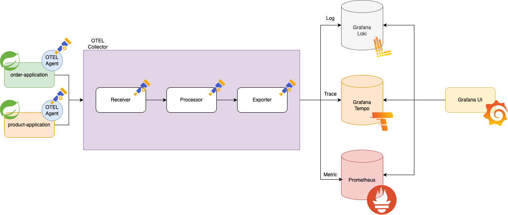
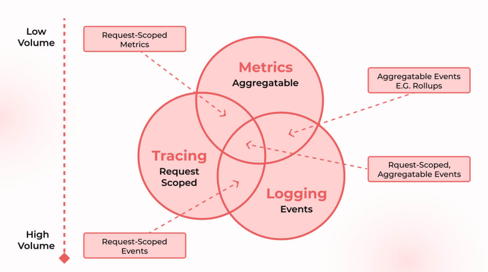

# Observability with spring boot application

A demo for `observability` on spring boot with opentelemetry

<div>
    
</div>

## Introduce

To simulate the `observability` of the system, in this repository will use the [opentelemetry](https://opentelemetry.io/docs/what-is-opentelemetry/) open source.  

The description of the `observability` is written on the opentelemetry
> Observability lets you understand a system from the outside by letting you ask questions about that system without knowing its inner workings.

The main instrumented data is `metric`, `trace` and `log`.  
Also you can create `correlations` between instrumented data.  

<div>
    
</div>

Grafana can create interactive links for Explore visualizations to run queries related to presented data by setting up [correlations](https://grafana.com/docs/grafana/latest/administration/correlations/).

## Command to Run

Generate docker images from each application

```shell
./gradlew -x clean :order-application:jibDockerBuild
./gradlew -x clean :product-application:jibDockerBuild
```

Run the docker compose!

```shell
docker compose up -d
```

## Test 

There is an test simulation file for http API.  
It is located on the [http folder](http). If you test from using http file, you can easy to make the trace data on tempo.

```http request
### get order
GET http://localhost:8080/api/v1/orders/1

### get product
GET http://localhost:8081/api/v1/products/1

### place order
POST http://localhost:8080/api/v1/orders/place-order
Content-Type: application/json

{
  "productId": 1
}
```

## Performance Test

Performance test is based on opensource [locust](https://docs.locust.io/en/stable/)

You can run the performance test by access `locust-master` endpoint `8089` port.  
Performance test script is located on [locustfile.py](locust/locustfile.py) you can customization own performance test scenario.  
