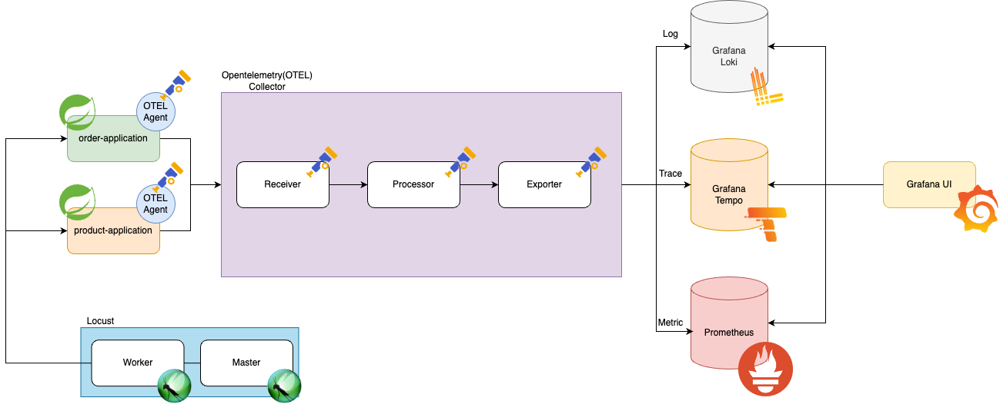

# Observability with spring boot application

A demo for `observability` on spring boot framework with opentelemetry

<div>
    
</div>

## Introduce

To realize the `observability` of the system, in this repository will use the [opentelemetry](https://opentelemetry.io/docs/what-is-opentelemetry/) open source.  

The description of the `observability` is written on the opentelemetry
> Observability lets you understand a system from the outside by letting you ask questions about that system without knowing its inner workings.

The main instrumented data is `metric`, `trace` and `log`.  
Also you can create `correlations` between instrumented data.  

<div>
    
</div>

Grafana can create interactive links for Explore visualizations to run queries related to presented data by setting up `correlations`.

## Command to Run

Generate docker images from each application

```shell
./gradlew -x clean :order-application:jibDockerBuild
./gradlew -x clean :product-application:jibDockerBuild
```

Run the docker compose!

```shell
docker compose up -d
```

## Test 

There is an example file for http test file.  
It is located on the [http folder](http)  

```http request
### get order
GET http://localhost:8080/api/v1/orders/1

### get product
GET http://localhost:8081/api/v1/products/1

### place order
POST http://localhost:8080/api/v1/orders/place-order
Content-Type: application/json

{
  "productId": 1
}
```